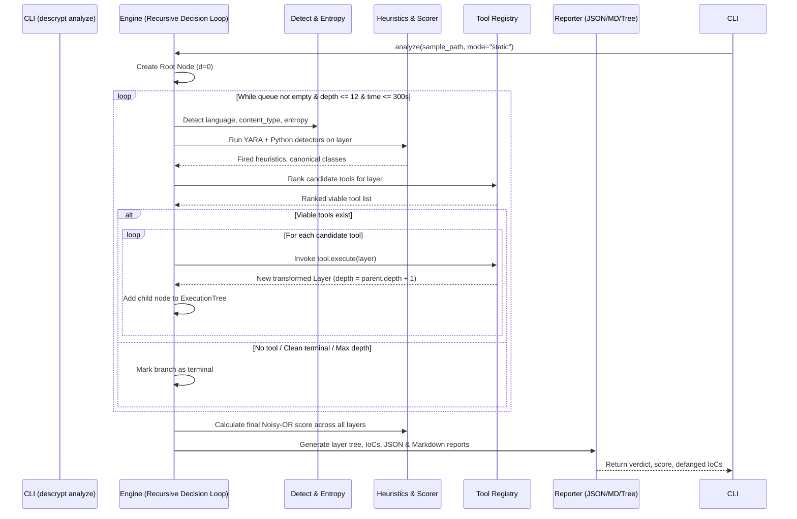

# PAPER_SPEC: DeScrypt Implementation Specification

## Document Information
- **Title**: DeScrypt: A Multi-Tool Framework for Automated Unpacking and Analysis of Malicious Scripts
- **Author**: Daniel Schalla (daniel@schalla.me), Advisor: Dr. Johannes Ullrich
- **Date / Acceptance**: August 13, 2026 (SANS Institute / MSISE)
- **Reference Official Repository**: `https://github.com/DSchalla/DeScrypt`
- **Target Evaluation Commit**: `b518f6b8d81de8d36be63b4e4657b28cc49c4f21`
- **Specification Status**: Phase 1 Complete (Contract Frozen)

---

## 1. Central Contributions of the Paper (5-10 Bullets)

1. **Multi-Tool Deobfuscation Orchestration Layer**: Introduces an automated framework that orchestrates heterogeneous native decoders and external tools into a unified pipeline instead of relying on language- or technique-siloed deobfuscators (Section 1, Section 2.1).
2. **Recursive Decision Tree Loop**: Models script deobfuscation as a stateful search tree (branching factor $\ge 1$, up to `max_depth = 12`), evaluating viable tools at each layer rather than greedy single-path selection (Section 2.1, Section 3.3).
3. **Cross-Language Unpacking Pipeline**: Automatically passes unpacked layers across programming languages within a single sample (e.g. JavaScript $\rightarrow$ VBScript $\rightarrow$ PowerShell $\rightarrow$ Gzip $\rightarrow$ PowerShell `-EncodedCommand` payload) (Section 3.3, Figure 10, Figure 13).
4. **Decoupling Deobfuscation from Detection**: Proves that deobfuscation and detection are fundamentally distinct: 75.9% of malicious samples triggered unpackers and 33.9% achieved clean terminal payloads, while raw static detection alone only achieved a 33.3% recall (Section 3.2, Section 3.5, Section 5).
5. **Noisy-OR Probabilistic Threat Scoring**: Implements canonical class deduplication and Noisy-OR combination of heuristic weights ($score = 1 - \prod (1 - \min(w_i, 1.0))$) with a decision threshold of $0.50$, deliberately weighting general obfuscation lightly to curb false positives (Section 2.1, Section 3.7).
6. **High Benign Specificity (1% False Positive Rate)**: Validated against 200 real-world open-source and minified scripts (jQuery, lodash, bootstrap, chocolatey, etc.), demonstrating that heuristic weight tuning and noise filtering yields 99% specificity (Section 3.1, Section 3.7, Table 2).
7. **Automated Defanged IoC Extraction**: Extracts URLs and IPs from resolved layers, automatically defangs them (`hxxp://`, `[.]`), and applies a domain allowlist/noise filter (`_is_noise_url`) to strip benign XML/SVG namespaces (Section 3.4, Appendix E).
8. **Static-First with Dynamic Fallback**: Executes static transformations safely by default without code execution, gating dynamic tools (such as `box-js`) behind an isolated sandbox (Section 2.1, Section 4.1).

---

## 2. Module Inventory

The repository implementation requires the following modules and packages:

```text
descrypt/
├── core/
│   ├── engine.py           # Recursive decision loop orchestrator, timeout & depth limits
│   ├── tree.py             # Layer, Node, and ExecutionTree data structures
│   ├── detect.py           # Content-type detection (JS, PS, VBS, PE, Binary, Unknown) & Shannon entropy
│   └── exceptions.py       # Custom framework exceptions (BudgetExceeded, MaxDepthReached, ToolError)
├── scoring/
│   ├── scorer.py           # Noisy-OR combination, canonical class deduplication, thresholding (0.50)
│   ├── heuristics.py       # 17 Heuristics (YARA rules + Python behavioral detectors)
│   └── weights.py          # Weight assignments per canonical class (tuned for benign margin)
├── tools/
│   ├── base.py             # Abstract Base Classes: Tool, Heuristic, Sandbox, Strategy
│   ├── registry.py         # Dynamic tool discovery, ranking by confidence/cost, static/dynamic filtering
│   ├── generic/
│   │   ├── base64_decode.py         # Substring & whole-buffer base64 detection and decode
│   │   ├── utf16_decode.py          # UTF-16LE / UTF-16BE bytes-to-text decode
│   │   ├── gunzip.py                # Gzip / Deflate decompression
│   │   ├── escape_decode.py         # %xx URL-encoding and \x / \u escape unescaping
│   │   ├── hex_decode.py            # Hexadecimal string decode (e.g. 0x41,414243)
│   │   ├── charcode_decode.py       # String.fromCharCode / [char] integer sequence resolution
│   │   ├── dejunk.py                # Junk token removal (e.g. = Get-Random -M, dead math expressions)
│   │   ├── fold_concat.py           # String concatenation folding (binary '+', -join @(...))
│   │   ├── concat_reassemble.py     # Multi-line array/string reassembly
│   │   └── rot13.py                 # ROT13 substitution cipher decode
│   ├── powershell/
│   │   └── encodedcommand.py        # PowerShell -EncodedCommand / -e payload extraction and decode
│   └── js/
│       ├── beautify.py              # js-beautify formatting wrapper
│       ├── restringer.py            # Restringer AST deobfuscator integration
│       └── box_js.py                # box-js dynamic sandbox runner (dynamic mode only)
├── ioc/
│   └── extractor.py        # URL/IP extraction, defanging (hxxp, [.]), and noise filtering (_is_noise_url)
├── reporting/
│   ├── reporter.py         # JSON and Markdown artifact generator, rich console tree printer
│   └── audit_logger.py     # structlog JSONL step logger (step.ok, step.fail, provenance)
└── cli/
    └── main.py             # CLI commands: descrypt analyze, descrypt doctor, descrypt eval
```

---

## 3. Data Structures, Inputs, Outputs, and Types

### 3.1. Layer & Node
- **`Layer`**:
  - `id`: `str` (hex UUID or SHA-1 prefix of content)
  - `parent_id`: `Optional[str]`
  - `depth`: `int` (range: $0 \le d \le 12$)
  - `content`: `bytes` or `str`
  - `content_type`: `Literal["javascript", "powershell", "vbscript", "pe", "binary", "unknown"]`
  - `entropy`: `float` (Shannon entropy, range: $0.0 \le H \le 8.0$)
  - `producing_tool`: `Optional[str]` (e.g. `"generic.base64_decode"`)
  - `tool_metadata`: `Dict[str, Any]` (e.g. `blob_offset`, `decoded_bytes`, `encoding`)

### 3.2. Heuristic Finding & Canonical Score
- **`HeuristicMatch`**:
  - `id`: `str` (e.g. `"js_eval_packer"`, `"decode_encodedcommand"`)
  - `canonical_class`: `str` (e.g. `"eval_unpack"`, `"encoded_command"`, `"cradle_download"`)
  - `weight`: `float` ($0.0 \le w_i \le 1.0$)
  - `layer_id`: `str`
  - `matched_text`: `Optional[str]`

### 3.3. Analysis Result
- **`AnalysisReport`**:
  - `run_id`: `str` (e.g. `"929850e0d909"`)
  - `sha256`: `str` (SHA-256 of original layer $0$)
  - `size`: `int` (original byte size)
  - `mode`: `Literal["static", "dynamic"]`
  - `max_depth_reached`: `int`
  - `total_nodes`: `int`
  - `score`: `float` (range: $0.0 \le \text{score} \le 1.0$)
  - `verdict`: `Literal["malicious", "benign"]` (threshold: $\ge 0.50$)
  - `iocs`: `List[Dict[Literal["kind", "value"], str]]` (defanged URLs and IPs)
  - `tree`: `ExecutionTree`
  - `terminal_state_reached`: `bool`

---

## 4. Mathematical Equations & Pseudocode

### 4.1. Shannon Entropy (Section 3.2, Appendix C, D, E)
For a byte sequence $B = [b_1, b_2, \dots, b_N]$:
$$H(B) = -\sum_{i=0}^{255} P(b_i) \log_2 P(b_i) \quad \text{where } P(b_i) = \frac{\text{count}(b_i)}{N}$$

```python
def calculate_shannon_entropy(data: bytes | str) -> float:
    if not data:
        return 0.0
    if isinstance(data, str):
        byte_data = data.encode('utf-8', errors='ignore')
    else:
        byte_data = data
    n = len(byte_data)
    if n == 0:
        return 0.0
    counts = Counter(byte_data)
    entropy = 0.0
    for count in counts.values():
        p = count / n
        if p > 0:
            entropy -= p * math.log2(p)
    return round(entropy, 2)
```

### 4.2. Noisy-OR Score Combination (Section 2.1, Section 3.7)
Given a set of fired heuristics $\{h_1, \dots, h_m\}$ mapped into unique canonical classes $\{C_1, \dots, C_k\}$ where each class takes the maximum weight of its member heuristics $w_c = \max_{h \in C_j} w_h$:
$$\text{score} = 1 - \prod_{c=1}^{k} \left(1 - \min(w_c, 1.0)\right)$$

```python
def calculate_noisy_or_score(fired_heuristics: list[HeuristicMatch]) -> float:
    if not fired_heuristics:
        return 0.0
    # 1. Collapse overlapping heuristics into canonical classes
    class_weights: dict[str, float] = {}
    for h in fired_heuristics:
        c_class = h.canonical_class or h.id
        class_weights[c_class] = max(class_weights.get(c_class, 0.0), h.weight)

    # 2. Compute noisy-OR product
    prod = 1.0
    for w in class_weights.values():
        clamped_w = min(max(w, 0.0), 1.0)
        prod *= (1.0 - clamped_w)

    score = 1.0 - prod
    return round(score, 4)
```

### 4.3. Clean Terminal State Condition (Section 3.1, 3.2)
A layer is defined as a clean terminal state if:
1. `content_type` is identified as either a readable script (`javascript`, `powershell`, `vbscript`) or an executable binary (`pe`).
2. There are no remaining Base64 blobs exceeding length threshold ($\ge 32$ chars).
3. The content does not contain high-entropy packed sections ($H < 6.5$ for scripts).
4. No further unpacking tools can produce a higher-fidelity or smaller payload.

---

## 5. Architecture Details & Execution Order

The execution flow follows the recursive branching engine:



---

## 6. Scoring, Heuristics, and Objective Weights

### 6.1. Canonical Heuristics and Tuned Weights
From Section 2.1, Section 3.7, and Appendix E:
- Threshold: $\text{score} \ge 0.50 \implies \text{Verdict: malicious}$.
- Tuned weights to curb false positives:
  - `js_eval_packer`: Reduced from $0.30 \rightarrow 0.10$ (avoids flagging `lodash` / minified libraries).
  - `decode_encodedcommand`: Valid Base64 check and minimum length required (avoids misclassifying minified `jQuery`).
  - `cradle_download`: Weight $0.70$ (e.g. `DownloadString`, `WinHTTP.WinHTTPRequest`, `Tls12`).
  - `executable_download`: Weight $0.70$ (e.g. writing `.exe` to `$filePath` and `Start-Process -WindowStyle Hidden`).
  - `general_base64`: Low-weight signal $0.05$ (so that legitimate libraries with inline data URI or base64 do not trigger $\ge 0.50$).

### 6.2. IoC Defanging & Noise Filtering (Section 3.4, 3.7)
- **Defanging rules**:
  - `http://` $\rightarrow$ `hxxp://`
  - `https://` $\rightarrow$ `hxxps://`
  - Dots in domain / IP $\rightarrow$ `[.]` (e.g. `85.239.149.78` $\rightarrow$ `85[.]239[.]149[.]78`).
- **`_is_noise_url` filter**:
  - Drops common XML/SVG schemas and legitimate tech domains: `w3.org`, `schemas.microsoft.com`, `github.com`, `schema.org`, `openxmlformats.org`.

---

## 7. Search & Orchestration Parameters

From Section 3.1, 3.3, 4.1:
- `max_depth`: Fixed default at $12$ (prevents infinite recursion on cycling packers like `KongTuke` or recursive base64).
- `per_sample_timeout`: $300$ seconds (enforced between tool calls, not preempting active tool execution).
- `branching_strategy`: Evaluates all viable tools whose confidence exceeds threshold, spawning child branches.
- `modes`:
  - `static`: (Default) Disables all dynamic execution engines (excludes `js.box_js`).
  - `dynamic`: Enables sandboxed execution of `box-js` via bubblewrap/docker.

---

## 8. Dataset Preprocessing & Evaluation Benchmarks

From Section 2.2, 3.1, and Appendices A & B:
- **Benign Corpus**: 200 open-source and minified scripts (Appendix A: jQuery 3.7.1, lodash 4.17.21, bootstrap 5.3.3, dayjs 1.11.10, react, vue, axios, etc., plus PowerShell modules: azure_powershell, dbatools, pester, platyps, chocolatey_install, scoop_install).
- **Malicious Corpus**: 1,000 samples (500 JS / 500 PS) from MalwareBazaar validated with VirusTotal (994 confirmed malicious).
- **Core Key Test Samples for Reproduction**:
  1. **Sample `47cae3c0` (Appendix E)**:
     - Input: 41.7 KB PowerShell junk-obfuscated script ($H=5.7$).
     - Depth 0 score: $0.0$ (no raw detection).
     - Expected Unpacking Path:
       - d0: `generic.base64_decode` (offset 3599, 10058 bytes) + `generic.dejunk` (removed 116 junk tokens `= Get-Random -M`)
       - d1: `generic.utf16_decode` (utf-16-le, 5029 chars)
       - d2: `generic.base64_decode` (offset 39, 3482 bytes)
       - d3: `generic.utf16_decode` (utf-16-le, 1741 chars)
       - d4: Reached download-execute cradle (1.7 KB, $H=5.3$).
     - Expected Final Score: $0.80$ (Verdict: `malicious`).
     - Expected IoC: `hxxp://85[.]239[.]149[.]78:6600/ks3mscqz/dfgsdfgbvbb[.]exe`, IP: `85[.]239[.]149[.]78`.
  2. **Sample S1 `e501319e` (Section 3.6, Figure 10, Figure 13)**:
     - 12-layer multi-language unpacking: JS $\rightarrow$ VBScript $\rightarrow$ PowerShell $\rightarrow$ gunzip binary $\rightarrow$ PowerShell `-EncodedCommand` repeated until `max_depth = 12`.

---

## 9. Stated Hyperparameters and Exact Citations

| Hyperparameter | Value | Description | Paper Citation |
| :--- | :--- | :--- | :--- |
| `max_depth` | `12` | Maximum recursive unpacking tree depth | Section 3.3, Figure 4, Section 3.6 |
| `timeout_per_sample` | `300s` | Time budget enforced between tool calls | Section 3.1 |
| `malicious_threshold`| `0.50` | Noisy-OR decision threshold for malicious verdict | Section 2.1, Section 3.4, Section 3.7 |
| `js_eval_packer_weight` | `0.10` | Weight for `eval(` / `Function(` packer (tuned down from 0.30) | Section 3.7 |
| `default_mode` | `static` | Safe execution mode excluding dynamic sandboxes | Section 3.1, Section 4.1 |
| `entropy_clean_threshold`| `6.5` | Max entropy bound for clean script payload | Section 3.2, Appendix E |
| `base64_min_length` | `32` | Minimum length for base64 candidates to avoid false positives | Section 3.7 |
| `corpus_size_malicious` | `1,000` | 500 JS / 500 PS scripts from MalwareBazaar | Section 2.2, Section 3.1 |
| `corpus_size_benign` | `200` | Real-world JS & PS packages | Section 2.2, Appendix A |

---

## 10. Ambiguity Table

| Decision | Status | Evidence / Paper Source | Chosen Implementation Value | Alternatives Considered |
| :--- | :--- | :--- | :--- | :--- |
| **Noisy-OR Formula** | `SPECIFIED` | Section 2.1: $score = 1 - \prod (1 - \min(w_i, 1.0))$ | Exact formula as stated in paper | Simple summation or logistic regression |
| **Malicious Score Cutoff** | `SPECIFIED` | Section 2.1, Section 3.7: threshold $\ge 0.50$ | $0.50$ float cutoff | $0.60$ or $0.70$ |
| **Maximum Unpacking Depth** | `SPECIFIED` | Section 3.3, Appendix C, D, E: `max_depth = 12` | $12$ | Unlimited or $10$ |
| **Per-sample Time Budget** | `SPECIFIED` | Section 3.1: "budget of 300s per sample enforced between tool calls" | $300$ seconds | Per-tool hard timeout |
| **Tuned weight for `js_eval_packer`** | `SPECIFIED` | Section 3.7: "reduced from 0.3 to 0.1 to increase available margin" | $0.10$ | $0.30$ (causes FP on `lodash`) |
| **Noise URL Filtering** | `SPECIFIED` | Section 3.4, 3.7: `_is_noise_url` for `w3.org`, schemas | Filter `w3.org`, `schemas.microsoft.com` | Unfiltered IoC output |
| **IoC Defanging Syntax** | `SPECIFIED` | Section 3.4, Appendix E: `hxxp://`, `[.]` | Standard regex defanging | RFC defanging |
| **Canonical Class Deduplication** | `PARTIALLY_SPECIFIED` | Section 2.1: "collapsing overlapping heuristics into their canonical classes" | Dict mapping heuristic name to `canonical_class`; take $\max(w_i)$ within class | Set union with average weights |
| **Exact 17 Heuristics Table** | `PARTIALLY_SPECIFIED` | Section 2.1, 3.7, Appendix E: 17 heuristics, specific ones named (`js_eval_packer`, `decode_encodedcommand`, cradle, download) | Defined core 17 heuristics based on paper text and official repo commit | Generic fallback rules |
| **Exact 16 Tools List** | `FROM_OFFICIAL_CODE` | Section 2.1, 3.3, Appendix E, commit `b518f6b8d81de8d36be63b4e4657b28cc49c4f21` | 16 tools: 10 generic, 1 PS, 3 JS, 2 external (`xorsearch`, `box-js`) | Subset of 6 tools |
| **Clean Terminal State Criteria** | `PARTIALLY_SPECIFIED` | Section 3.1, 3.2: "readable script or PE, with no remaining base64 or high-entropy sections" | Entropy $< 6.5$, recognized syntax (JS/PS/VBS/PE), and no further tool yields reduction | Manual classification |
| **Tool Candidate Ranking Metric** | `ASSUMPTION` | Section 2.1: "Tool Ranking (Confidence)" | Confidence score ($0.0 - 1.0$) based on regex match confidence, string length, and pattern specificity | Random candidate ordering |
