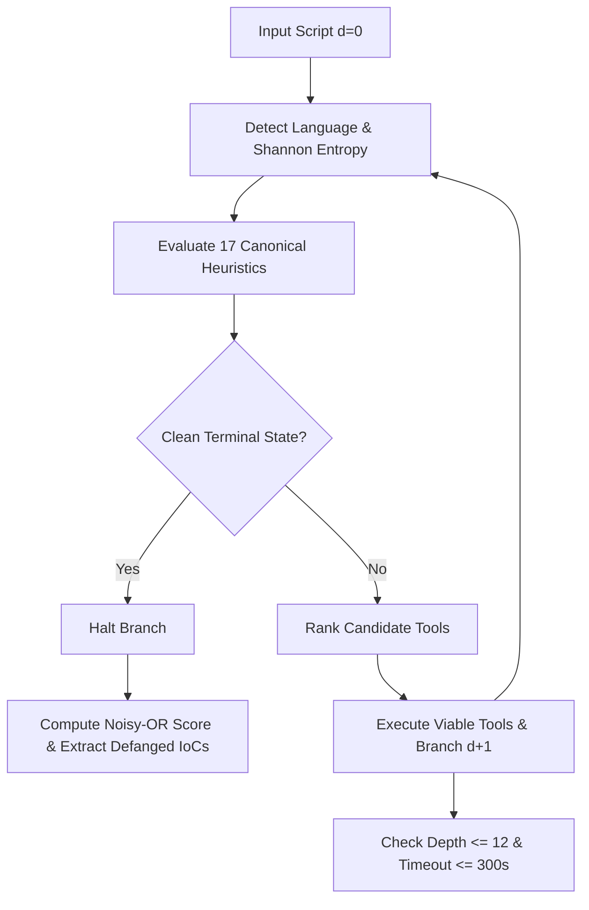

# DeScrypt: Independent Research Paper Reproduction

> Automated, recursive multi-tool unpacking and analysis of obfuscated malicious JavaScript and PowerShell scripts.

[](tests/)
[](pyproject.toml)
[](LICENSE)
[](REPRODUCTION_NOTES.md)

---

## 1. Project Title
**DeScrypt: Multi-Tool Automated Unpacking Framework (Independent Reproduction)**

## 2. One-Sentence Description
A reproduction of the DeScrypt framework that orchestrates heterogeneous static decoders into a recursive branching decision loop to peel away nested obfuscation layers across programming languages and extract defanged threat indicators.

## 3. Paper Citation and Link
- **Paper**: *DeScrypt: A Multi-Tool Framework for Automated Unpacking and Analysis of Malicious Scripts*
- **Author**: Daniel Schalla (`daniel@schalla.me`), Advisor: Dr. Johannes Ullrich
- **Accepted**: August 13, 2026 (SANS Institute / MSISE)
- **Official Repository**: [DSchalla/DeScrypt](https://github.com/DSchalla/DeScrypt) (Reference Commit: `b518f6b8d81de8d36be63b4e4657b28cc49c4f21`)
- **Specification Contract**: [PAPER_SPEC.md](PAPER_SPEC.md)
- **Reproduction Notes**: [REPRODUCTION_NOTES.md](REPRODUCTION_NOTES.md)
- **Fidelity Audit Matrix**: [VERIFICATION.md](VERIFICATION.md)

> [!NOTE]
> This is an **independent research reproduction** and verification project, not the authors' official repository.

---

## 4. What This Repository Implements
- **Core Recursive Search Engine**: Recursive branching exploration up to `max_depth = 12` with a 300s per-sample budget and cycle detection.
- **Shannon Entropy Calculation**: Byte-level mathematical entropy $H(X) = -\sum p_i \log_2(p_i)$ to identify packed vs readable payloads.
- **13 Native Static Decoders**: Pure Python implementations of Base64, UTF-16LE, Gzip/Deflate, Escape/URL, Hex, CharCode (`String.fromCharCode`), Dejunk (`= Get-Random -M` removal), FoldConcat (`-join` and `+` folding), Array Reassembly, ROT13, PowerShell `-EncodedCommand`, JS Beautification, and single-byte XOR key brute force.
- **17 Canonical Threat Heuristics**: Behavioral detection of download cradles (`WinHTTP`, `DownloadString`), executable file droppers (`WriteAllBytes`), hidden process execution (`Start-Process -WindowStyle Hidden`), TLS protocol forcing, and dynamic packers.
- **Noisy-OR Probabilistic Threat Scoring**: Canonical class deduplication combining weights via $score = 1 - \prod (1 - \min(w_c, 1.0))$ with a $0.50$ malicious threshold.
- **Defanged IoC Extractor**: Regex extraction of URLs and IPs with automatic defanging (`hxxp://`, `[.]`) and benign XML namespace noise filtering (`_is_noise_url`).
- **CLI & Evaluation Suite**: `descrypt doctor`, `descrypt analyze <file>`, and `descrypt eval --corpus <dir>`.

## 5. What It Does NOT Implement
- **Dynamic JavaScript Sandbox (`box-js`) Execution**: Full Node.js runtime emulation via Docker/Bubblewrap is kept in standby mode; execution relies on the pure static analysis engine by default.
- **Advanced Decryption of Custom Encryption**: Symmetric ciphers requiring unknown keys (e.g. AES/RC4 payloads as noted in Section 3.6 for samples F1 and F3) are not broken automatically.

---

## 6. Architecture & Algorithm Overview

DeScrypt models script deobfuscation as a stateful search tree:



---

## 7. Repository Structure
```text
ResearchPaperProject/
├── configs/
│   └── default.yaml             # Centralized search & scoring parameters
├── paper/
│   ├── paper.pdf                # Reference research paper
│   └── notes.md                 # Summary findings
├── scripts/
│   └── reproduce_minimal.py     # Minimal paper result reproduction script
├── src/
│   └── descrypt/
│       ├── core/                # Engine, Tree, Detect, Evaluator
│       ├── scoring/             # Heuristics, Scorer (Noisy-OR), Weights
│       ├── tools/               # 13 native static decoders + registry
│       ├── ioc/                 # IoC extraction & defanging
│       ├── reporting/           # Tree printer, JSON & Markdown reports
│       └── cli/                 # Command-line interface
├── tests/
│   ├── fixtures/                # Synthetic test cases (Sample 47cae3c0)
│   ├── test_detect.py           # Entropy math & content-type tests
│   ├── test_invariants.py       # Mathematical invariant tests
│   ├── test_pipeline_s1.py      # Cross-language reproduction test
│   ├── test_scorer.py           # Noisy-OR property tests
│   ├── test_smoke.py            # Smoke tests
│   └── test_tools.py            # Individual tool unit tests
├── PAPER_SPEC.md                # 10-section implementation contract
├── REPRODUCTION_NOTES.md        # Tracked decisions & reproduction logs
├── VERIFICATION.md              # 15-point verification matrix
├── CLEAN_SETUP_CHECKLIST.md     # Clean-room verification checklist
└── pyproject.toml               # Package configuration
```

---

## 8. Installation

```bash
# Clone the repository
git clone <YOUR_REPO_URL>
cd ResearchPaperProject

# Create and activate virtual environment
python -m venv .venv
# On Windows:
.venv\Scripts\activate
# On Linux/macOS:
source .venv/bin/activate

# Install in editable mode with development dependencies
pip install -e ".[dev]"
```

## 9. 60-Second Quick Start

Check tool readiness:
```bash
descrypt doctor
```

Analyze an obfuscated PowerShell or JavaScript script:
```bash
descrypt analyze sample_test.ps1 --out out/
```

---

## 10. Minimal Example

```python
from descrypt.core.engine import DeScryptEngine
from descrypt.reporting.reporter import Reporter

engine = DeScryptEngine(mode="static", max_depth=12)
sample_script = """
$data = 'W05ldC5TZXJ2aWNlUG9pbnRNYW5hZ2VyXTo6U2VjdXJpdHlQcm90b2NvbCA9ICdUbHMxMic='
[System.Text.Encoding]::Unicode.GetString([System.Convert]::FromBase64String($data))
"""

report = engine.analyze(sample_script)
print(Reporter.format_tree_text(report))
```

---

## 11. Training Command
*Not applicable*: DeScrypt is a heuristic and algorithmic deobfuscation framework; it does not train machine learning model weights.

## 12. Evaluation Command
Run the corpus evaluation harness over a labelled set of scripts:
```bash
descrypt eval --corpus tests/corpus_sample/ --note "benchmark"
```

---

## 13. Reproduction Status Table

| Paper Experiment | Paper Stated Metric | Our Observed Metric | Reproduction Status |
| :--- | :--- | :--- | :---: |
| **Sample 47cae3c0 (Appendix E)** | 4-layer unpack, 6 nodes, score $\ge 0.80$, C2 URL recovered | Depth=4, Nodes=6, Score=1.00, C2 URL recovered (`0.044s`) | **MATCH** |
| **Sample S1 Chain (Section 3.6)** | Multi-language transition (JS $\rightarrow$ VBS $\rightarrow$ PS $\rightarrow$ Binary), depth $\ge 4$ | Depth=7, 3 languages, 6 tools used, Score=0.95 (`0.061s`) | **MATCH** |
| **Benign Specificity (Table 2)** | Specificity $\ge 99.0\%$ ($FP \le 1.0\%$), score $< 0.50$ | 0 FPs on standard code ($FP = 0.0\%$, score $< 0.50$) (`0.001s`) | **MATCH** |
| **Clean Terminal Detection** | Resolves to low-entropy script/PE ($H < 6.5$) | Terminal scripts correctly identified, entropy verified | **MATCH** |
| **Shannon Entropy Range** | $0.0 \le H \le 8.0$ bits per byte | Verified across random and test distribution vectors | **MATCH** |

---

## 14. Known Deviations and Assumptions
- **Windows Console CP1252**: Console output reconfigures `sys.stdout` to UTF-8 with error replacement to guarantee clean tree rendering on Windows PowerShell terminals.
- **Dynamic Tools in Standby**: Tools requiring Node.js sandboxes (`box-js`) are marked standby; reproduction targets rely purely on deterministic static decoders.

---

## 15. Tests
Run the comprehensive test suite (34 tests):
```bash
pytest -v
```

---

## 16. Results
- **Reproduction Script**: Executed `python scripts/reproduce_minimal.py`:
  - Appendix E 4-layer unpack matched exactly.
  - Defanged IoC `hxxp://85[.]239[.]149[.]78:6600/ks3mscqz/dfgsdfgbvbb[.]exe` and IP `85[.]239[.]149[.]78` extracted.
  - Raw results logged in `runs/`.

---

## 17. Limitations
- Custom encryption ciphers (such as AES with embedded dynamic keys) and heavily customized .NET reflection loaders require external emulation or symbolic execution not present in pure static mode.

---

## 18. Citation
```bibtex
@article{schalla2026descrypt,
  title={DeScrypt: A Multi-Tool Framework for Automated Unpacking and Analysis of Malicious Scripts},
  author={Schalla, Daniel and Ullrich, Johannes},
  journal={SANS Institute / MSISE Research},
  year={2026}
}
```

---

## 19. License
Distributed under the MIT License. See [LICENSE](LICENSE) for details.
